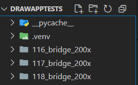

<!-- README.md -->

# AnnoMate - The Anomaly Detection Masking Tool

A Tkinter-based GUI tool to load images from an input directory, draw/erase colored “masks” (for different defect categories), and export those masks (per category) to separate output folders. It also lets you save metadata (inspector name, tray/directory, notes, defects, pen labels) and export a CSV or Excel sheet summarizing all annotations.

---
## CLI or EXE Versions

**For running AnnoMate through the CLI, start at [Command Line Interface Instructions](#command-line-interface-instuctions).**

**For packaging AnnoMate into a .EXE file using pyinstaller, start at [PyInstaller Packaging Instructions](#pyinstaller-packaging-instructions).**

# Command Line Interface Instructions

## Table of Contents

1. [Project Overview](#project-overview)
2. [Prerequisites](#prerequisites)
3. [Installation](#installation)
4. [Configuration](#configuration)
5. [Usage](#usage)
6. [File Structure](#file-structure)
7. [Exported Outputs](#exported-outputs)
8. [Troubleshooting](#troubleshooting)
9. [Contact](#contact)

---

## Project Overview

This tool (`draw_app.py`) lets an inspector:

- Browse through a folder of images
- Mark defects using up to five different “pens” (each pen corresponds to a specific color)
- Optionally fill an entire region with a pen color (flood fill) or do freehand marks/erasing
- Assign each pen to one of the defect categories (configurable via the JSON file `defects_config.json`)
- Enter metadata per image (e.g., inspector name, tray/directory, free-form note)
- Record which defect categories were selected for each image
- Export:
  - **Masks**: for each chosen defect, a separate mask image (PNG) saved to a category folder
  - **Metadata JSON**: maintains per-image metadata (`metadata.json` in `output_dir`)
  - **Excel sheet**: summarizes all images, indicating “Accept/Reject/Unlabeled” plus other columns
  - **CSV file**: same information as the Excel sheet, for easier ingestion

The GUI is built with Tkinter. Style constants and layout parameters live in `style_config.py`. The defect categories (and which pens map to which category) are defined in the JSON config file (`defects_config.json`).

---

## Prerequisites

1. **Python 3.8+**

   - Make sure you have Python 3 installed.
   - To check:
     ```bash
     python3 --version
     ```
   - On Windows/macOS, your installer likely includes Tkinter. On many Linux distros, you may need to install the “tk” package separately (e.g. `sudo apt-get install python3-tk` on Debian/Ubuntu).

2. **pip**

   - To install third-party packages.
   - To check:
     ```bash
     pip --version
     ```

3. **Required Python packages** (listed in `requirements.txt`):

   - **Pillow** (for image handling & drawing)
   - **openpyxl** (for Excel export)

   Install them via:

   ```bash
   pip install -r requirements.txt

   ```

4. **Optional VENV**

- It is recommended to create a virtual environment
- **Example:**
  python3 -m venv venv
  source venv/bin/activate # on macOS/Linux
  venv\Scripts\activate.bat # on Windows
  pip install -r requirements.txt

---

## Installation

1. **Clone/Copy files onto your machine**

- The minimum files needed are `draw_app.py`, `defects_config.json`, `style_config.py`, and `requirements.txt`

2. **Install requirements**

- If you havent, run the following:
  pip install -r requirements.txt

---

## Configuration

1. **Defects Configuration**

- The tool expects a JSON file (`defects_config.json`) that maps each “dataset name” to a list of defect categories. At runtime, you pass the --dataset argument to select which list to use. If the requested dataset key is not found, the "default" key is used.
- You can add as many dataset keys as you like. Under each key, provide an array of strings (each string is a defect category). These category labels appear as checkboxes in the “Categories” panel of the GUI.

---

## Usage

1. **Command to run program**
   python draw_app.py \
    --input_dir /path/to/your/images \
    --output_dir /path/where/you/want/results \
    --config defects_config.json \
    --dataset default

- 

- **--input_dir (required):** Path to a folder containing one or more images
- **--output_dir (required):** Path to a folder where all masks, metadata, and exports will be saved. If it doesn’t exist, it will be created.
- **--config (optional, default=defects_config.json):** Path to your JSON file with defect categories
- **--dataset (optional, default=default):** Select which key in defects_config.json to use. Must match a top-level key in that JSON.

2. **Once launched, the GUI window appears with two panels**

**Left panel/Canvas**:

- Shows the current image plus any “mask layers” you draw
- Left-click + drag to draw a mark (with the currently selected pen/color)
- Right-click + drag to pan around the zoomed image
- “−” or “+” in the Zoom group to zoom out/in.
- Draw/Erase buttons to switch between freehand draw and eraser
- “PEN FILL MODE” checkbox; when enabled, clicking on the canvas flood-fills the current pen’s color into a contiguous region
- Pen selection buttons (Use PEN1 … Use PEN5) to activate the corresponding pen color for drawing

**Right panel/Controls**:

1. Main controls:

- Prev / Next to Navigate between images (automatically persists until application is closed unless clear was used)
- Clear to clear everything (masks, metadata fields) for the current image
- Undo / Redo to step backward/forward in the drawing history (mark-by-mark)
- Draw / Erase to switch between freehand draw and eraser
- Save to explicitly save current image’s mask and metadata

2. Zoom controls:

- “−” to zoom out (down to 10% min)
- “+” to zoom in (up to 1000% max)

3. Information controls:

- Note for free-form text box about the image
- Inspector; single-line text entry for whoever is using the tool
- Tray/Directory; single-line text entry for whatever tray the image is on
- Last saved; displays timestamp when last Save occurred (or “never”)

4. Categories controls:

- One checkbox per defect as defined by the chosen dataset in `defects_config.json`
- If you check multiple defects, when exporting masks, each checked category will produce its own mask file containing only the pixels drawn in that pen’s color
- If no defect is checked, the image is treated as “good”

5. Fill controls:

- “PEN FILL MODE” toggle; when enabled, clicking on the canvas flood-fills the current pen’s color into a contiguous region

6. Pen controls:

- For PEN1 through PEN5, you see a dropdown (Combobox) of all defect categories
- Selecting a category here means “treat anything you drew/flood-filled with PEN1 color as that defect” when exporting
- Clicking Use Pen switches your cursor to that pen color (and sets mode = draw, cursor becomes a pencil)

7. Export Controls:

- Export as XLSX to write an Excel file named <input_dir_basename>.xlsx into --output_dir.
- Columns: Filename, Tray/Directory, Inspector, Accept/Reject, Defect(s), Notes.
- **“Accept/Reject” logic:**
  - If no metadata (tray, inspector, defects, notes) then it's “Unlabeled”.
  - If no defects but some other metadata exists then it's “Accept”.
  - If at least one defect is recorded then it's “Reject”.
- Export as CSV is the same columns/logic saved as CSV named <input_dir_basename>.csv into --output_dir.

---

## File Structure

1. **Input**

- your_project_folder/your_input_directory/your_images
- 

2. **Output**

- Output folders are created automatically if not created based on the information passed in the --output_dir parameter
- your_project_folder/your_output_directory/all exported materials
- Typically after some testing, should look something like this:
  - 

---

## Exported Outputs

**When you click save on an image, the following happens:**

1. A combined mask of all different pen marks on the image is saved under `<output_dir>/masks/<image_basename>_mask.png`

- This is a transparent RGBA image matching the original resolution; it contains all marks/fills you applied (every pen color) merged over a transparent background

2. For each defect category you checked (in “Categories”), a new image is generated

- It scans each pixel of the combined mask; if that pixel’s color matches any pen color labeled for that defect, it paints that pixel onto a new RGB image (black background) and is saved under `<output_dir>/<defect_name>/YYYYMMDD_HHMMSS_<inspector>_<image_basename>.png`

3. If no defect is checked then the image is treated as “good” (no per-defect masks created, but it still counts as “Accept” in exports)

**When you click one of the export buttons, the following happens:**

1. Information is taken from the `metadata.json` file is exported to a .XLSX file or a .CSV file

- The `metadata.json` file is created automatically in your output directory to store information about the images to repopulate when the program is closed and reopened or flipping through images

2. The .XLSX or .CSV file is saved under your output directory based off the name of your input directory

- 

---

# PyInstaller Packaging Instructions

---

## Troubleshooting

1. **No module named Tkinter:**

- On many Linux distributions, you must install the OS package:
  sudo apt-get update
  sudo apt-get install python3-tk
- On Windows/macOS, ensure you installed the full Python distribution (the “tkinter” extension should be bundled)

2. **No module named PIL:**

- Make sure you ran: pip install Pillow
- If you are in a virtual environment, ensure it's activated

3. **Openpyxl errors (“cannot import name ‘Workbook’"):**

- Make sure you ran: pip install openpyxl
- If you are in a virtual environment, ensure it's activated

4. **JSON config errors:**

- If defects_config.json is malformed JSON or missing a "default" key, the program will throw an error when loading; double-check your syntax

5. **Permission errors when saving:**

- Make sure --output_dir is a folder you have write access to; if it doesn’t exist, the program attempts to create it

---

## Contact

1. **Github Issues:** https://github.com/cjgeo22/AD_masking_tool/issues

2. **Email:** lgeorge@coastal.edu

3. **Slack:** @CJ George
